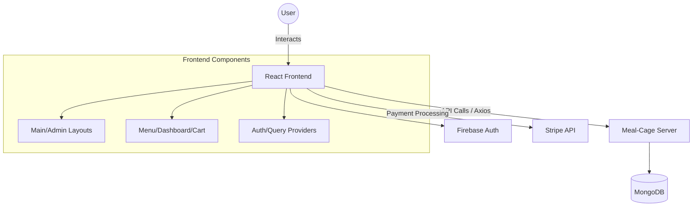

# Meal-Cage Client 🍽️

Meal-Cage is a modern restaurant management platform designed to provide a seamless dining experience for customers and an efficient management interface for administrators.

## 🚀 Features

- **Dynamic Menu**: Browse through categories like Pizza, Dessert, Soups, and Salads with real-time availability.
- **Authentication**: Secure login and sign-up powered by Firebase.
- **Cart & Payments**: Add items to your cart and pay securely using Stripe.
- **User Dashboard**: Track your orders, rewards, and gift cards.
- **Admin Dashboard**: Manage menu items, user roles, and order fulfillment.
- **Reviews & Ratings**: Share your dining experiences with the community.

## 🛠️ Tech Stack

- **Framework**: [React](https://reactjs.org/) with [Vite](https://vitejs.dev/)
- **Styling**: [Tailwind CSS](https://tailwindcss.com/) & [DaisyUI](https://daisyui.com/)
- **State Management**: [TanStack Query](https://tanstack.com/query/latest)
- **Authentication**: [Firebase](https://firebase.google.com/)
- **Payments**: [Stripe](https://stripe.com/)
- **Animations**: [AOS (Animate On Scroll)](https://michalsnik.github.io/aos/)

## 🏗️ Architecture View



## ⚙️ Getting Started

### Prerequisites

- Node.js (v24.x recommended)
- npm or yarn

### Installation

1. Clone the repository:
   ```bash
   git clone https://github.com/Rafiuzzamanrion/Meal-Cage-Restaurent.git
   ```
2. Install dependencies:
   ```bash
   npm install
   ```
3. Create a `.env.local` file in the root and add your credentials (check `.env.example` for required variables).
4. Start the development server:
   ```bash
   npm run dev
   ```

## 📄 License

This project is licensed under the ISC License.
